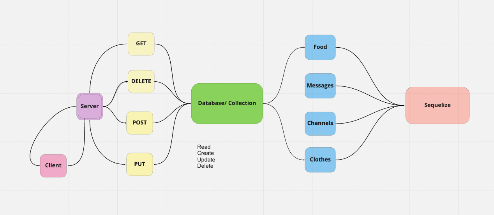

# api-server

## Author

Roop Hayer

## Summary of Problem Domain

Creating a server with database for CRUD app.

## Links to Application Deployment

[Heroku](*)

[Actions Page](https://github.com/RoopHayer/api-server/actions/new)

[PR](https://github.com/RoopHayer/api-server/pull/1)

## Include Embedded UML

## Routes

/food
/clothes
